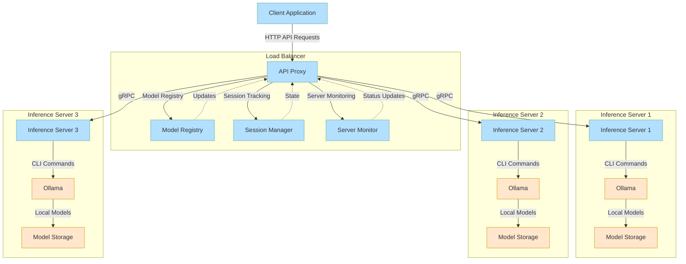
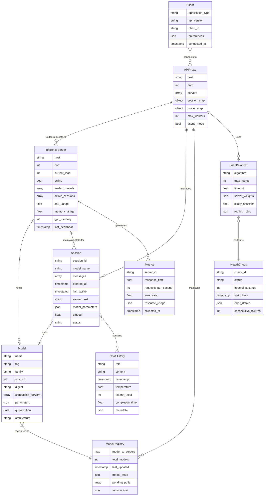

# OLOL - Ollama Load Balancing and Clustering

A distributed inference system that allows you to build a powerful multi-host cluster for Ollama AI models with transparent scaling and fault tolerance.

OLOL (Ollama Load Balancer) is a Python package providing gRPC interfaces with both synchronous and asynchronous support for distributed inference across multiple Ollama instances.


## Overview

This system provides a unified API endpoint that transparently distributes inference requests across multiple Ollama instances running on different hosts. It maintains compatibility with the Ollama API while adding clustering capabilities.

### Key Features

- **Transparent API Compatibility**: Drop-in replacement for the Ollama API
- **Automatic Load Balancing**: Distributes requests across available servers
- **Model Awareness**: Routes requests to servers that have the requested model
- **Session Affinity**: Maintains chat history consistently across requests
- **Redundancy**: Can pull models to multiple servers for high availability
- **Monitoring**: Built-in status endpoint to monitor the cluster
- **Distributed Inference**: Automatically splits large models across multiple servers for faster inference

## Architecture

The system consists of these main components:

1. **gRPC Server**: Runs on each inference host with local Ollama installed
2. **API Proxy Client**: Provides a unified Ollama API endpoint for applications
3. **RPC Server**: Enables distributed inference by splitting model layers across servers
4. **Inference Coordinator**: Manages distributed inference and model partitioning
5. **Protocol Buffer Definition**: Defines the communication contract

### Distributed Inference

OLOL supports distributed inference, which allows you to split large models across multiple servers:

- **Layer Partitioning**: Automatically splits model layers across available servers
- **Auto-Detection**: Automatically uses distributed inference for large models (13B+)
- **Hardware Optimization**: Allocates model layers based on server hardware capabilities
- **Transparent API**: No changes required to your client code
- **Advanced Options**: Fine-tune distribution with API options

Distributed inference is particularly useful for:
- Running very large models (>13B parameters) across multiple smaller machines
- Speeding up inference by parallelizing model computation
- Enabling models too large to fit in a single machine's memory

### Model Quantization

OLOL intelligently handles model quantization:

- **Smart Quantization**: Automatically selects the best quantization level based on hardware and model size
- **Compatibility Detection**: Checks if a compatible quantization is already loaded
- **On-Demand Loading**: Can load models with appropriate quantization when needed
- **Quantization Fallbacks**: Can use higher-quality quantization to serve lower-quality requests

### Auto-Discovery

OLOL includes an auto-discovery system for zero-configuration clustering:

- **Server Auto-Registration**: RPC servers automatically find and register with the proxy
- **Capability Broadcasting**: Servers advertise their hardware capabilities and device types
- **Dynamic Scaling**: New servers are automatically added to the cluster when they come online
- **Subnet Detection**: Servers automatically scan the subnet to find the proxy

Quantization compatibility rules:
- `q4_0` (smallest memory usage): Compatible with models loaded as q4_0, q4_1, q5_0, q5_1, or q8_0
- `q5_0` (balanced): Compatible with models loaded as q5_0, q5_1, or q8_0
- `q8_0` (highest quality): Only compatible with q8_0
- `f16` (unquantized): Only compatible with f16

When requested quantization isn't available, OLOL will:
1. Try to find a model with compatible (higher-quality) quantization
2. Try to load the model with the requested quantization
3. If that fails, load with the best quantization for the available hardware

### System Architecture



### Entity Relationship Model



### Request Flow Sequence

```mermaid
sequenceDiagram
    participant Client as Client Application
    participant Proxy as API Proxy
    participant Registry as Model Registry
    participant SessionMgr as Session Manager
    participant Server1 as Inference Server 1
    participant Server2 as Inference Server 2
    participant Ollama as Ollama CLI
    
    Client->>+Proxy: POST /api/chat (model: llama2)
    Proxy->>+Registry: Find servers with llama2
    Registry-->>-Proxy: Server1 and Server2 available
    
    Proxy->>+SessionMgr: Create/Get Session
    alt New Session
        SessionMgr-->>-Proxy: New Session ID
        Note over Proxy,Server1: Select Server1 (lowest load)
        Proxy->>+Server1: CreateSession(session_id, "llama2")
        Server1->>Ollama: ollama run llama2
        Server1-->>-Proxy: Session Created
    else Existing Session
        SessionMgr-->>-Proxy: Existing Session on Server2
        Note over Proxy,Server2: Maintain Session Affinity
    end
    
    Proxy->>+Server1: ChatMessage(session_id, message)
    Server1->>Ollama: ollama run with history
    Ollama-->>Server1: Response
    Server1-->>-Proxy: Chat Response
    Proxy-->>-Client: JSON Response
    
    Note right of Client: Later: Model Update
    
    Client->>+Proxy: POST /api/pull (model: mistral)
    Proxy->>+Registry: Check model status
    Registry-->>-Proxy: Not available
    
    par Pull to Server1
        Proxy->>+Server1: PullModel("mistral")
        Server1->>Ollama: ollama pull mistral
        Server1-->>Proxy: Stream Progress
    and Pull to Server2
        Proxy->>+Server2: PullModel("mistral") 
        Server2->>Ollama: ollama pull mistral
        Server2-->>Proxy: Stream Progress
    end
    
    Server1-->>-Proxy: Pull Complete
    Server2-->>-Proxy: Pull Complete
    Proxy->>Registry: Update model->server map
    Proxy-->>-Client: Pull Complete Response
```

## Installation

```bash
# Install from PyPI (once published)
uv pip install olol

# Install with extras
uv pip install "olol[proxy,async]"

# Development installation
git clone https://github.com/K2/olol.git
cd olol
uv pip install -e ".[dev]"

# Build and install from source
cd olol
./tools/build-simple.sh
uv pip install dist/olol-0.1.0-py3-none-any.whl
```

## Quick Start

### 1. Start Ollama instances

Start multiple Ollama instances on different machines or ports.

### 2. Start the gRPC servers

```bash
# Start a synchronous server
olol server --host 0.0.0.0 --port 50051 --ollama-host http://localhost:11434

# Start an asynchronous server (on another machine)
olol server --host 0.0.0.0 --port 50052 --ollama-host http://localhost:11434 --async
```

### 3. Start the load balancing proxy

```bash
# Basic proxy with load balancing
olol proxy --host 0.0.0.0 --port 8000 --servers "192.168.1.10:50051,192.168.1.11:50051"

# Start with distributed inference enabled
olol proxy --host 0.0.0.0 --port 8000 --servers "192.168.1.10:50051,192.168.1.11:50051" --distributed

# With custom RPC servers for distributed inference
olol proxy --servers "192.168.1.10:50051,192.168.1.11:50051" --distributed --rpc-servers "192.168.1.10:50052,192.168.1.11:50052"

# Auto-discovery mode (will automatically find and add new servers)
olol proxy --distributed --discovery

# Specify network interface for multi-network-interface setups
olol proxy --distributed --interface 10.0.0.5
```

### 4. Set up distributed inference (optional)

For large models, you can shard the model across multiple servers for faster inference:

```bash
# Start RPC servers on each machine that will participate in distributed inference
olol rpc-server --host 0.0.0.0 --port 50052 --device auto

# With optimized settings for large models
olol rpc-server --device cuda --flash-attention --context-window 16384 --quantize q5_0

# Auto-discovery mode (servers will automatically find and register with proxies)
olol rpc-server --discovery

# Specify preferred network interface when multiple are available
olol rpc-server --device cuda --interface 192.168.1.10

# Testing distributed inference directly
olol dist --servers "192.168.1.10:50052,192.168.1.11:50052" --model llama2:13b --prompt "Hello, world!"
```

### 5. Use the client

```bash
# Test with the command-line client
olol client --host localhost --port 8000 --model llama2 --prompt "Hello, world!"

# Or use the async client
olol client --host localhost --port 8000 --model llama2 --prompt "Hello, world!" --async
```

## Python API

### Synchronous Client

```python
from olol.sync import OllamaClient

client = OllamaClient(host="localhost", port=8000)
try:
    # Stream text generation
    for response in client.generate("llama2", "What is the capital of France?"):
        if not response.done:
            print(response.response, end="", flush=True)
        else:
            print(f"\nCompleted in {response.total_duration}ms")
finally:
    client.close()
```

### Asynchronous Client

```python
import asyncio
from olol.async import AsyncOllamaClient

async def main():
    client = AsyncOllamaClient(host="localhost", port=8000)
    try:
        # Stream text generation
        async for response in client.generate("llama2", "What is the capital of France?"):
            if not response.done:
                print(response.response, end="", flush=True)
            else:
                print(f"\nCompleted in {response.total_duration}ms")
    finally:
        await client.close()

asyncio.run(main())
```

### HTTP API Usage

Once the proxy is running, connect your client applications to it using the standard Ollama API:

```bash
# Example: Chat with a model
curl -X POST http://localhost:8000/api/chat -d '{
  "model": "llama2",
  "messages": [{"role": "user", "content": "Hello, how are you?"}]
}'

# Using distributed inference explicitly
curl -X POST http://localhost:8000/api/generate -d '{
  "model": "llama2:13b",
  "prompt": "Write a poem about distributed computing",
  "options": {
    "distributed": true
  }
}'
```

### Status Endpoint

Monitor the status of your cluster:

```bash
curl http://localhost:8000/api/status
```

## Configuration

### Command-Line Interface

The main command-line interface accepts various arguments:

```bash
# Show available commands
olol --help

# Show options for a specific command
olol server --help
olol proxy --help
```

### Direct Command Tools

OLOL also provides direct command tools that can be used with `uv run`:

```bash
# Start a proxy server
uv run olol-proxy --distributed --discovery

# Start an RPC server
uv run olol-rpc --device cuda --quantize q5_0 --context-window 8192

# Start a standard server
uv run olol-server --host 0.0.0.0 --port 50051

# Run distributed inference
uv run olol-dist --servers "server1:50052,server2:50052" --model llama2:13b --prompt "Hello!"

# Use the client
uv run olol-client --model llama2 --prompt "Tell me about distributed systems"
```

These command tools accept the same options as their corresponding `olol` commands:

Environment variables:

**OLOL configuration:**
- `OLLAMA_SERVERS`: Comma-separated list of gRPC server addresses (default: "localhost:50051")
- `OLOL_PORT`: HTTP port for the API proxy (default: 8000)
- `OLOL_LOG_LEVEL`: Set logging level (default: INFO)

**Ollama optimization settings:**
- `OLLAMA_FLASH_ATTENTION`: Enable FlashAttention for faster inference
- `OLLAMA_NUMA`: Enable NUMA optimization if available
- `OLLAMA_KEEP_ALIVE`: How long to keep models loaded (e.g., "1h")
- `OLLAMA_MEMORY_LOCK`: Lock memory to prevent swapping
- `OLLAMA_LOAD_TIMEOUT`: Longer timeout for loading large models
- `OLLAMA_QUANTIZE`: Quantization level (e.g., "q8_0", "q5_0", "f16")
- `OLLAMA_CONTEXT_WINDOW`: Default context window size (e.g., "8192", "16384")
- `OLLAMA_DEBUG`: Enable debug mode with additional logging
- `OLLAMA_LOG_LEVEL`: Set Ollama log level

## Contributing

Contributions are welcome! Please check out our [Contribution Guidelines](CONTRIBUTING.md).

## License

This project is licensed under the MIT License - see the [LICENSE](LICENSE) file for details.
