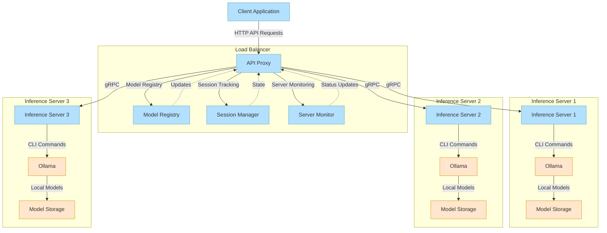

```mermaid
flowchart TD
    Client[Client Application] -->|HTTP API Requests| Proxy[API Proxy]
    
    subgraph Load Balancer
        Proxy -->|Model Registry| Registry[Model Registry]
        Proxy -->|Session Tracking| Sessions[Session Manager]
        Proxy -->|Server Monitoring| Monitor[Server Monitor]
    end
    
    Registry -.->|Updates| Proxy
    Sessions -.->|State| Proxy
    Monitor -.->|Status Updates| Proxy
    
    Proxy -->|gRPC| Server1[Inference Server 1]
    Proxy -->|gRPC| Server2[Inference Server 2]
    Proxy -->|gRPC| Server3[Inference Server 3]
    
    subgraph "Inference Server 1"
        Server1 -->|CLI Commands| Ollama1[Ollama]
        Ollama1 -->|Local Models| ModelDir1[Model Storage]
    end
    
    subgraph "Inference Server 2"
        Server2 -->|CLI Commands| Ollama2[Ollama]
        Ollama2 -->|Local Models| ModelDir2[Model Storage]
    end
    
    subgraph "Inference Server 3" 
        Server3 -->|CLI Commands| Ollama3[Ollama]
        Ollama3 -->|Local Models| ModelDir3[Model Storage]
    end
    
    class Client,Proxy,Registry,Sessions,Monitor,Server1,Server2,Server3 componentNode;
    class Ollama1,Ollama2,Ollama3,ModelDir1,ModelDir2,ModelDir3 resourceNode;
    
    classDef componentNode fill:#b3e0ff,stroke:#9cc,stroke-width:2px;
    classDef resourceNode fill:#ffe6cc,stroke:#d79b00,stroke-width:1px;
```