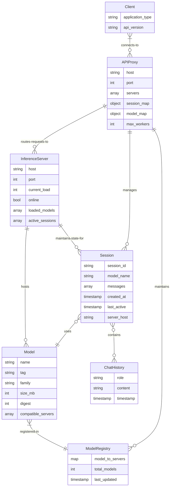

```mermaid
erDiagram
    APIProxy ||--o{ InferenceServer : "routes-requests-to"
    APIProxy ||--o{ Session : "manages"
    APIProxy ||--o{ ModelRegistry : "maintains"
    InferenceServer ||--o{ Model : "hosts"
    InferenceServer ||--o{ Session : "maintains-state-for"
    Session }o--|| Model : "uses"
    Model }|--|| ModelRegistry : "registered-in"
    Client }|--o{ APIProxy : "connects-to"
    Session }o--o{ ChatHistory : "contains"
    
    APIProxy {
        string host
        int port
        array servers
        object session_map
        object model_map
        int max_workers
    }
    
    InferenceServer {
        string host
        int port
        int current_load
        bool online
        array loaded_models
        array active_sessions
    }
    
    Model {
        string name
        string tag
        string family
        int size_mb
        int digest
        array compatible_servers
    }
    
    Session {
        string session_id
        string model_name
        array messages
        timestamp created_at
        timestamp last_active
        string server_host
    }
    
    ChatHistory {
        string role
        string content
        timestamp timestamp
    }
    
    Client {
        string application_type
        string api_version
    }
    
    ModelRegistry {
        map model_to_servers
        int total_models
        timestamp last_updated
    }
```