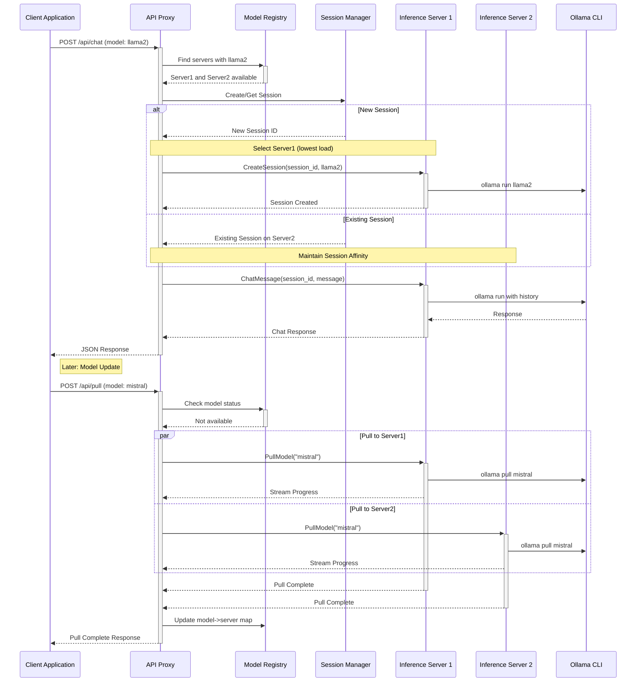

```mermaid
sequenceDiagram
    participant Client as Client Application
    participant Proxy as API Proxy
    participant Registry as Model Registry
    participant SessionMgr as Session Manager
    participant Server1 as Inference Server 1
    participant Server2 as Inference Server 2
    participant Ollama as Ollama CLI
    
    Client->>+Proxy: POST /api/chat (model: llama2)
    Proxy->>+Registry: Find servers with llama2
    Registry-->>-Proxy: Server1 and Server2 available
    
    Proxy->>SessionMgr: Create/Get Session
    alt New Session
        SessionMgr-->>Proxy: New Session ID
        Note over Proxy,Server1: Select Server1 (lowest load)
        Proxy->>+Server1: CreateSession(session_id, llama2)
        Server1->>Ollama: ollama run llama2
        Server1-->>-Proxy: Session Created
    else Existing Session
        SessionMgr-->>Proxy: Existing Session on Server2
        Note over Proxy,Server2: Maintain Session Affinity
    end
    
    Proxy->>+Server1: ChatMessage(session_id, message)
    Server1->>Ollama: ollama run with history
    Ollama-->>Server1: Response
    Server1-->>-Proxy: Chat Response
    Proxy-->>-Client: JSON Response
    
    Note right of Client: Later: Model Update
    
    Client->>+Proxy: POST /api/pull (model: mistral)
    Proxy->>+Registry: Check model status
    Registry-->>-Proxy: Not available
    
    par Pull to Server1
        Proxy->>+Server1: PullModel("mistral")
        Server1->>Ollama: ollama pull mistral
        Server1-->>Proxy: Stream Progress
    and Pull to Server2
        Proxy->>+Server2: PullModel("mistral") 
        Server2->>Ollama: ollama pull mistral
        Server2-->>Proxy: Stream Progress
    end
    
    Server1-->>-Proxy: Pull Complete
    Server2-->>-Proxy: Pull Complete
    Proxy->>Registry: Update model->server map
    Proxy-->>-Client: Pull Complete Response
```
